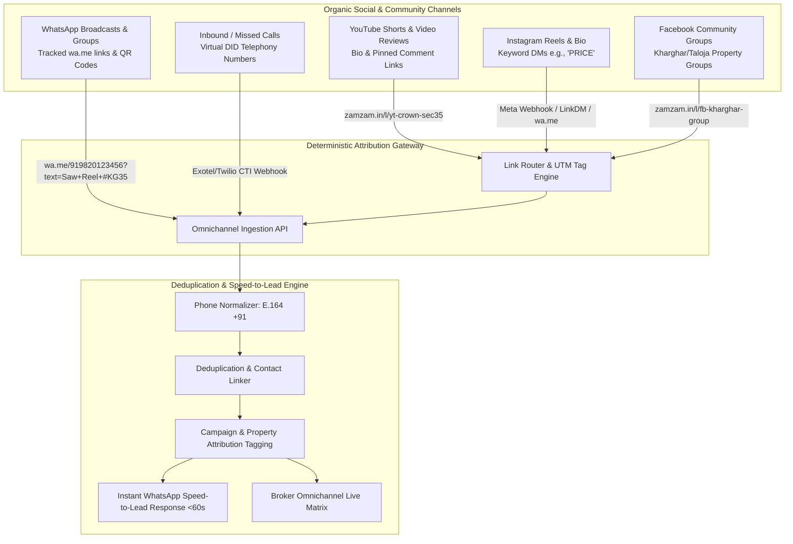

# Phase 2 Plan: Organic Inbound Lead Attribution & Multi-Channel Ingestion

**Phase**: 02  
**Name**: Organic Inbound Lead Attribution & Multi-Channel Ingestion  
**Agents**: `/agency-social-media-strategist`, `/agency-software-architect`, `/agency-backend-architect`  
**Status**: Ready for Execution  

---

## 1. Architectural Scope & Social Strategy

Phase 2 engineers the zero-ad organic lead capture and deterministic attribution pipeline for ZamZam Properties. Because the brokerage relies 100% on organic social reach (YouTube Shorts, Instagram Reels/DMs, Facebook Groups, and WhatsApp Groups) rather than paid Meta/Google ads, every lead must be deterministically tagged with the exact video, reel, Facebook group, or broadcast link that generated the inquiry.



---

## 2. Domain Decomposition & Aggregates

### 2.1 Bounded Contexts
1. **Attribution & Campaign Context**: Shortened tracking links, campaign registry, organic channel types, dynamic QR codes, and pre-filled WhatsApp deep link generators.
2. **Omnichannel Ingestion Context**: Webhook receivers for Meta Instagram, WhatsApp Cloud API, Facebook campaign forms, and Cloud Telephony (Exotel/Twilio).
3. **Contact Identity & Deduplication Context**: E.164 normalization (+91 for India), multi-inquiry merging, and lead lifecycle timeline.
4. **Speed-to-Lead Automation Context**: Sub-60-second automated WhatsApp response templates matching the featured property.

---

## 3. Database Schema Extensions (PostgreSQL + Prisma)

### 3.1 DDL Schema Additions
```sql
-- 1. CAMPAIGN TRACKING REGISTRY
CREATE TABLE inbound_campaigns (
    id UUID PRIMARY KEY DEFAULT gen_random_uuid(),
    organization_id UUID NOT NULL REFERENCES organizations(id) ON DELETE CASCADE,
    campaign_name VARCHAR(150) NOT NULL,
    channel_type VARCHAR(50) NOT NULL, -- 'YOUTUBE_SHORT', 'YOUTUBE_VIDEO', 'INSTAGRAM_REEL', 'INSTAGRAM_DM', 'FB_GROUP', 'WHATSAPP_GROUP', 'DIRECT_CALL'
    content_id VARCHAR(100),            -- e.g. YouTube Video ID, Instagram Reel Shortcode
    target_property_unit_id UUID REFERENCES property_units(id),
    target_project_id UUID REFERENCES developer_projects(id),
    custom_slug VARCHAR(100) UNIQUE NOT NULL, -- e.g. 'yt-sec35-sobha', 'fb-kharghar-investors'
    wa_prefilled_text TEXT NOT NULL,
    total_clicks INT DEFAULT 0,
    total_leads_generated INT DEFAULT 0,
    is_active BOOLEAN DEFAULT TRUE,
    created_at TIMESTAMPTZ NOT NULL DEFAULT NOW()
);
CREATE INDEX idx_campaign_slug ON inbound_campaigns(custom_slug);
CREATE INDEX idx_campaign_channel ON inbound_campaigns(channel_type);

-- 2. RAW WEBHOOK AUDIT INBOX (Idempotent Event Log)
CREATE TABLE webhook_events_inbox (
    id UUID PRIMARY KEY DEFAULT gen_random_uuid(),
    event_source VARCHAR(50) NOT NULL, -- 'INSTAGRAM_GRAPH', 'WHATSAPP_CLOUD', 'TELEPHONY_EXOTEL', 'WEB_FORM'
    idempotency_key VARCHAR(120) UNIQUE NOT NULL,
    payload_json JSONB NOT NULL,
    status VARCHAR(30) DEFAULT 'PROCESSED', -- 'PENDING', 'PROCESSED', 'FAILED'
    processed_at TIMESTAMPTZ DEFAULT NOW(),
    error_message TEXT,
    created_at TIMESTAMPTZ NOT NULL DEFAULT NOW()
);
CREATE INDEX idx_webhook_idempotency ON webhook_events_inbox(idempotency_key);

-- 3. COMMUNICATION & TOUCHPOINT LOGS
CREATE TABLE communication_logs (
    id UUID PRIMARY KEY DEFAULT gen_random_uuid(),
    lead_id UUID NOT NULL REFERENCES leads(id) ON DELETE CASCADE,
    channel VARCHAR(30) NOT NULL, -- 'WHATSAPP', 'PHONE_CALL', 'SMS', 'INSTAGRAM_DM'
    direction VARCHAR(10) NOT NULL, -- 'INBOUND', 'OUTBOUND'
    message_content TEXT,
    call_duration_seconds INT DEFAULT 0,
    call_recording_url TEXT,
    metadata_json JSONB DEFAULT '{}'::jsonb,
    created_at TIMESTAMPTZ NOT NULL DEFAULT NOW()
);
CREATE INDEX idx_comm_lead ON communication_logs(lead_id);
```

---

## 4. Backend Service Layer & Architectural Contracts

### 4.1 Phone Normalization & Deduplication Contract (`src/lib/domain/phone-normalizer.ts`)
* Normalizes any raw phone input (e.g. `09820123456`, `9820123456`, `+91 98201 23456`) into standard E.164: `+919820123456`.
* Rejects invalid number sequences and returns detailed validation telemetry.

### 4.2 Deep Link & QR Code Generator (`src/lib/domain/attribution-engine.ts`)
* Generates zero-collision `wa.me` links with URL-encoded metadata:
  $$\text{URL} = \text{https://wa.me/} + \text{Phone} + \text{?text=} + \text{URLEncode}(\text{PrefilledText})$$
* Parses incoming messages to automatically extract referenced Property IDs or Reel codes.

### 4.3 REST API Endpoints (`src/app/api/v1/attribution/` & `src/app/api/v1/leads/`)
1. `GET & POST /api/v1/attribution/campaigns`: Campaign tracking CRUD and analytics.
2. `GET /api/v1/track/:slug`: Redirection gateway that counts clicks and redirects to WhatsApp / landing page.
3. `POST /api/v1/webhooks/whatsapp`: WhatsApp Cloud API webhook receiver.
4. `POST /api/v1/webhooks/instagram`: Meta/Instagram Graph API webhook receiver.
5. `POST /api/v1/webhooks/telephony`: Exotel/Twilio missed-call & CTI inbound webhook.
6. `GET & POST /api/v1/leads`: Lead matrix CRUD with filter by organic source, campaign, and stage.

---

## 5. UI/UX Deliverables (Social Marketing & Lead Inbox)

1. **Campaign Tracking & Deep-Link Studio (`/attribution`)**:
   - One-click generator for YouTube Shorts, Instagram Reels, Facebook Groups, and WhatsApp Groups.
   - Live QR Code generator for print flyers / WhatsApp status updates.
   - Click-to-copy `wa.me` link with instant clipboard notification.
   - Click-through and lead conversion analytics per campaign link.

2. **Omnichannel Lead Matrix & Live Triage Inbox (`/leads`)**:
   - Real-time lead matrix with source badges (📱 YouTube Short, 📸 Instagram Reel, 👥 Facebook Group, 💬 WhatsApp Group, 📞 Missed Call).
   - Speed-to-lead status indicators (e.g., *Captured 2m ago via Reel #KG36*).
   - One-click WhatsApp speed-to-lead acknowledgment trigger.
   - Filter by Campaign, Channel, Broker, and Stage.

---

## 6. Verification & Acceptance Criteria (UAT)

1. **Deterministic Attribution Test**:
   - An inbound message payload `Hi ZamZam, saw your YouTube Short #YT-TALOJA-01` must create a lead with `leadSource = "YOUTUBE_SHORT"` and `campaignId` mapped to the Taloja campaign.
2. **E.164 Phone Normalization Test**:
   - Ingesting `98201 23456`, `09820123456`, and `+919820123456` must all resolve to the identical record `+919820123456` without creating duplicate contacts.
3. **Idempotency Webhook Test**:
   - Sending the same webhook payload twice with the same idempotency key must return `200 OK` on the duplicate without creating two lead entries.
4. **Campaign Click Counter Test**:
   - Hitting `GET /api/v1/track/fb-kharghar-investors` must increment `totalClicks` by 1 and return a 302 redirect.
