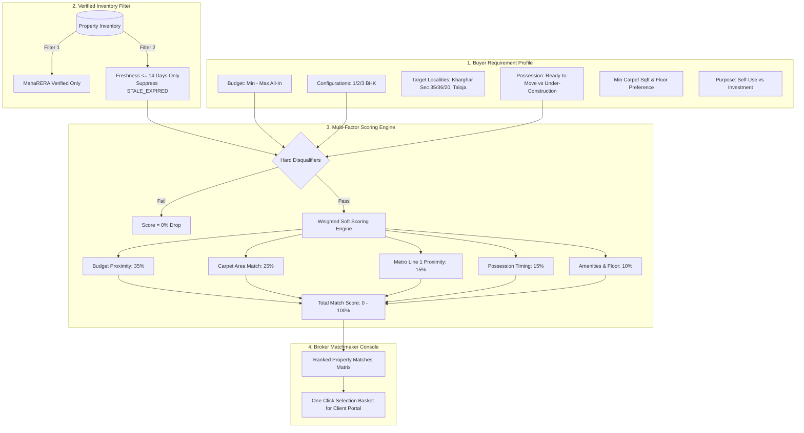

# Phase 3 Plan: Consultative Requirement Profiling & Dynamic Requirements-to-Property Matching Engine

**Phase**: 03  
**Name**: Consultative Requirement Profiling & Dynamic Requirements-to-Property Matching Engine  
**Agents**: `/agency-software-architect`, `/agency-backend-architect`  
**Status**: Ready for Execution  

---

## 1. Architectural Scope & Domain Logic

Phase 3 builds the core intelligence layer of the CRM: **Requirements-to-Property Matching**. When a buyer arrives from YouTube Shorts, Instagram Reels, Facebook Groups, or inbound calls, brokers capture their structured requirements. The engine instantly evaluates all active, verified inventory against statutory capitalized acquisition costs ($C_{\text{all-in}}$) and micro-market characteristics, ranking units with a transparent **Match Score (0%–100%)**.

---

## 2. Mathematical Scoring Model & Hard Invariants

### 2.1 Hard Disqualifiers (Score = 0%)
1. **Budget Invariant**: If $C_{\text{all-in}} > \text{Budget}_{\max} \times 1.05$ (strict $+5\%$ stretch tolerance ceiling), unit is immediately disqualified.
2. **BHK Invariant**: If unit configuration is not present in buyer's accepted BHK array (e.g. unit is 3 BHK but buyer strictly wants 1 BHK), unit is disqualified.
3. **OC/RTM Invariant**: If buyer specifies mandatory `READY_TO_MOVE` and property does not hold an Occupancy Certificate (OC), unit is disqualified.
4. **Staleness Invariant**: If property verification status is `STALE_EXPIRED` or `last_verified_at > 14 days ago`, unit is hidden from automated matching.

### 2.2 Weighted Scoring Formula ($W_{\text{total}} = 100\%$)
$$\text{Match Score} = (S_{\text{budget}} \times 0.35) + (S_{\text{carpet}} \times 0.25) + (S_{\text{transit}} \times 0.15) + (S_{\text{possession}} \times 0.15) + (S_{\text{amenities}} \times 0.10)$$

* **$S_{\text{budget}}$ (35% weight)**:
  $$S_{\text{budget}} = \max\left(0, 1.0 - \frac{|C_{\text{all-in}} - \text{Target Budget}|}{\text{Target Budget}}\right)$$
* **$S_{\text{carpet}}$ (25% weight)**:
  $$S_{\text{carpet}} = \min\left(1.0, \frac{\text{Unit Carpet Sqft}}{\text{Min Carpet Sqft}}\right)$$
* **$S_{\text{transit}}$ (15% weight)**:
  - $<0.5\text{ km to Metro}$: $1.0$
  - $0.5\text{--}1.0\text{ km}$: $0.85$
  - $>1.0\text{ km}$: $\max(0.3, 1.0 - (\text{Distance} \times 0.15))$
* **$S_{\text{possession}}$ (15% weight)**:
  - Exact match (e.g. buyer wants Dec 2026 and project delivers Dec 2026): $1.0$
  - Within 6 months tolerance: $0.80$
  - Beyond tolerance: $0.50$
* **$S_{\text{amenities}}$ (10% weight)**:
  - Matches requested amenities (Clubhouse, Pool, Gym, High-rise floor) ratio.

---

## 3. Database Schema & Service Contracts

### 3.1 Domain Services (`src/lib/domain/matching-engine.ts`)
* `evaluatePropertyMatch(requirement: BuyerRequirement, unit: PropertyUnitWithProject)`:
  - Evaluates hard constraints.
  - Computes sub-scores and aggregated weighted percentage (e.g. `94.2%`).
  - Generates human-readable match rationale (e.g. *"✅ ₹3.2L under max budget • 450m from Metro Line 1 • 🟢 OC Received"*).

### 3.2 REST API Endpoints (`src/app/api/v1/matching/`)
1. `GET /api/v1/matching/leads/:leadId`: Fetches ranked property matches for a specific lead profile with itemized score breakdowns.
2. `POST /api/v1/matching/simulate`: Stateless matching simulation endpoint for brokers to test arbitrary budget/BHK combinations in real-time.
3. `PUT /api/v1/leads/:leadId/requirements`: Updates or creates structured requirement profiles for a lead.

---

## 4. UI/UX Deliverables (Broker Matchmaker Console)

1. **Interactive Matchmaker Console (`/matching` & `/matching/[leadId]`)**:
   - Split-view interface:
     - **Left Pane (Requirement Adjuster)**: Live sliders for Min/Max Budget, BHK multi-select, Locality checkboxes, Possession type toggle, and Min Carpet Area.
     - **Right Pane (Ranked Results)**: Live cards sorted by match score with visual match badges:
       - 🟢 **90%–100% (Prime Match)**
       - 🔵 **75%–89% (Strong Alternative)**
       - 🟡 **60%–74% (Budget/Location Compromise)**
   - Itemized score breakdown breakdown popup showing exact math for Budget, Carpet, Transit, and Possession.
   - **One-Click Selection**: Checkboxes to select top 3–5 properties and instantly trigger client portal generation (Phase 4 bridge).

2. **Lead Detail Requirement Tab (`/leads`)**:
   - Direct link from lead card to Matchmaker console: `[⚡ Run Matchmaker]`.

---

## 5. Verification & Acceptance Criteria (UAT)

1. **Hard Disqualifier Test**:
   - For a buyer with a ₹60,00,000 all-in budget, a property with $C_{\text{all-in}} = ₹65,00,000$ ($>+5\%$ limit) must be disqualified with `score = 0%`.
2. **Transit Weight Test**:
   - Between two identical 2 BHK units at ₹65L, the unit within 450m of Metro Line 1 must rank higher than the unit 2.5km away.
3. **Staleness Exclusion Test**:
   - Units flagged with `STALE_EXPIRED` must be excluded from match results even if their price and BHK match perfectly.
4. **Live Score Accuracy Test**:
   - Match calculation output must contain itemized sub-scores (`budgetScore`, `carpetScore`, `transitScore`, `possessionScore`, `totalScore`).
