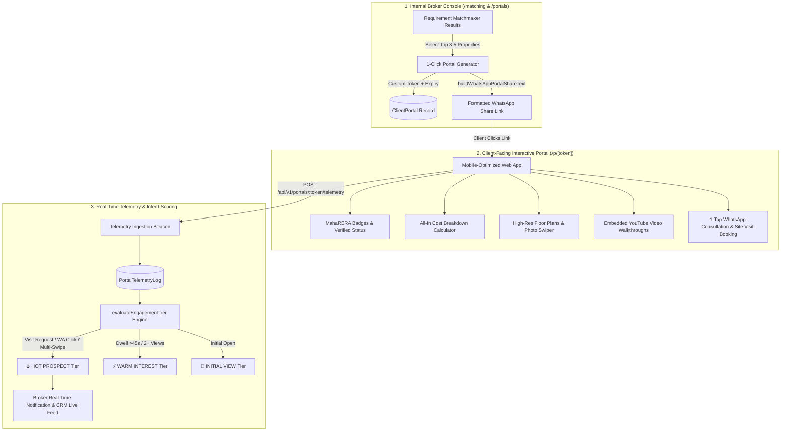

# Phase 4 Plan: Shareable Client Property Presentation Portals & Real-Time Buyer Telemetry

**Phase**: 04  
**Name**: Shareable Client Property Presentation Portals & Real-Time Buyer Telemetry  
**Agents**: `/agency-frontend-developer`, `/agency-software-architect`, `/agency-backend-architect`  
**Status**: Ready for Execution  

---

## 1. Architectural Scope & Domain Logic

Phase 4 bridges the internal CRM intelligence with the buyer-facing presentation layer. Instead of sending cluttered PDFs or unformatted WhatsApp text messages, brokers generate a private, white-labeled, interactive **Client Property Presentation Portal** (`/p/[token]`) with a single click from the Requirement Matchmaker.

The client portal delivers a luxury mobile-first browsing experience while silently emitting granular **telemetry events** (`PORTAL_OPEN`, `PHOTO_SWIPE`, `BROCHURE_DOWNLOAD`, `VIDEO_PLAY`, `WHATSAPP_CLICK`, `VISIT_BOOKING_CLICK`) back to the CRM. This allows brokers to understand exact client intent in real-time and engage leads precisely when their buying motivation is highest.



---

## 2. Domain Decomposition & Aggregates

### 2.1 Bounded Contexts
1. **Client Portal Context**: Nonce/Token generation, multi-property basket curation, broker highlights, custom greeting messages, expiration lifecycle.
2. **Interactive Presentation Context**: Responsive property card carousel, all-inclusive statutory cost sheet viewer, floor plan lightbox, YouTube video integration, Google Maps transit directions.
3. **Telemetry & Engagement Context**: Beacon event capture, dwell time tracking, session aggregation, behavioral scoring heuristics.
4. **Broker Notification Context**: Hot-lead alerts, engagement tier badges in the CRM dashboard, proactive follow-up prompts.

### 2.2 Domain Invariants & Business Rules
* **Invariant 1 (Staleness Protection)**: If a property in a portal becomes `STALE_EXPIRED` or is archived after the portal was generated, the portal must visually flag or gracefully hide the outdated unit and show remaining active inventory.
* **Invariant 2 (Token Determinism & Security)**: Portal tokens must be human-readable yet unguessable (`{client-name}-{bhk}-{4char-nonce}`), scoped to the organization, and support revocation/expiry.
* **Invariant 3 (Real-Time Intent Thresholds)**:
  - **HOT PROSPECT**: Triggered immediately if the client clicks `VISIT_BOOKING_CLICK`, `WHATSAPP_CLICK`, or downloads a brochure after swiping 4+ photos.
  - **WARM INTEREST**: Triggered if total dwell time $\ge 45\text{ seconds}$, photo swipes $\ge 2$, or total visits $\ge 2$.
  - **INITIAL VIEW**: Logged upon initial portal page load.

---

## 3. Database Schema Extensions (PostgreSQL + Prisma)

### 3.1 DDL Schema Additions
```sql
-- 1. CLIENT PORTALS (Curated Client Portfolios)
CREATE TABLE client_portals (
    id UUID PRIMARY KEY DEFAULT gen_random_uuid(),
    organization_id UUID NOT NULL REFERENCES organizations(id) ON DELETE CASCADE,
    lead_id UUID NOT NULL REFERENCES leads(id) ON DELETE CASCADE,
    token VARCHAR(100) UNIQUE NOT NULL, -- e.g. 'rahul-sharma-2bhk-kharghar-a9b2'
    title VARCHAR(200) NOT NULL,        -- e.g. 'Curated 2 BHK Properties for Rahul Sharma'
    custom_message TEXT,               -- Broker's personalized note
    created_by_user_id UUID REFERENCES users(id),
    expires_at TIMESTAMPTZ,
    is_active BOOLEAN NOT NULL DEFAULT TRUE,
    total_views INT NOT NULL DEFAULT 0,
    last_viewed_at TIMESTAMPTZ,
    created_at TIMESTAMPTZ NOT NULL DEFAULT NOW(),
    updated_at TIMESTAMPTZ NOT NULL DEFAULT NOW()
);
CREATE INDEX idx_portals_token ON client_portals(token);
CREATE INDEX idx_portals_lead ON client_portals(lead_id);

-- 2. PORTAL PROPERTIES (Ordered Selection Basket)
CREATE TABLE client_portal_units (
    id UUID PRIMARY KEY DEFAULT gen_random_uuid(),
    portal_id UUID NOT NULL REFERENCES client_portals(id) ON DELETE CASCADE,
    property_unit_id UUID NOT NULL REFERENCES property_units(id) ON DELETE CASCADE,
    display_order INT NOT NULL DEFAULT 1,
    broker_highlight VARCHAR(255),     -- e.g. 'Corner unit with open Sahyadri hill view'
    is_featured BOOLEAN NOT NULL DEFAULT FALSE,
    created_at TIMESTAMPTZ NOT NULL DEFAULT NOW()
);
CREATE INDEX idx_portal_units_portal ON client_portal_units(portal_id);
CREATE INDEX idx_portal_units_unit ON client_portal_units(property_unit_id);

-- 3. PORTAL TELEMETRY LOGS (Granular Behavioral Stream)
CREATE TABLE portal_telemetry_logs (
    id UUID PRIMARY KEY DEFAULT gen_random_uuid(),
    portal_id UUID NOT NULL REFERENCES client_portals(id) ON DELETE CASCADE,
    unit_id UUID REFERENCES property_units(id) ON DELETE SET NULL,
    action_type VARCHAR(50) NOT NULL, -- 'PORTAL_OPEN', 'UNIT_EXPAND', 'PHOTO_SWIPE', 'VIDEO_PLAY', 'BROCHURE_DOWNLOAD', 'MAP_OPEN', 'WHATSAPP_CLICK', 'CALL_CLICK', 'VISIT_BOOKING_CLICK'
    dwell_time_sec INT NOT NULL DEFAULT 0,
    ip_address VARCHAR(45),
    user_agent TEXT,
    metadata_json JSONB DEFAULT '{}'::jsonb,
    created_at TIMESTAMPTZ NOT NULL DEFAULT NOW()
);
CREATE INDEX idx_telemetry_portal_action ON portal_telemetry_logs(portal_id, action_type);
CREATE INDEX idx_telemetry_created ON portal_telemetry_logs(created_at);
```

---

## 4. Backend Service Layer & Architectural Contracts

### 4.1 Portal Domain Service (`src/lib/domain/portal-generator.ts`)
```typescript
export interface PortalGenerationInput {
  leadId: string;
  leadName: string;
  leadPhone: string;
  selectedUnitIds: string[];
  customMessage?: string;
  createdById?: string;
}

export function generatePortalToken(leadName: string, bhkDescription: string): string;

export function buildWhatsAppPortalShareText(params: {
  leadName: string;
  portalUrl: string;
  propertyCount: number;
  microMarkets: string[];
}): string;

export type EngagementTier = 'HOT_PROSPECT' | 'WARM_INTEREST' | 'INITIAL_VIEW' | 'NO_ACTIVITY';

export interface TelemetrySummary {
  totalViews: number;
  dwellTimeSeconds: number;
  photoSwipes: number;
  brochureDownloads: number;
  videoPlays: number;
  whatsAppInquiries: number;
  visitBookingsRequested: number;
  engagementTier: EngagementTier;
  brokerAlertMessage?: string;
}

export function evaluateEngagementTier(
  logs: Array<{ actionType: string; dwellTimeSec?: number }>
): TelemetrySummary;
```

### 4.2 REST API Endpoints (`src/app/api/v1/portals/`)
1. `GET & POST /api/v1/portals`: List all created portals with aggregated telemetry summaries; create new portal.
2. `GET /api/v1/portals/:id`: Fetch internal portal details with full audit logs and lead history.
3. `GET /api/v1/portals/token/:token`: Public endpoint for client app to fetch sanitized portal metadata, project specifications, and verified property units.
4. `POST /api/v1/portals/:token/telemetry`: High-speed beacon receiver to log client interaction events and return updated engagement status.

---

## 5. UI/UX Deliverables

### 5.1 Client-Facing Portal Experience (`/p/[token]`)
* **Header & Trust Banner**:
  - ZamZam Properties verification stamp & MahaRERA Broker Registration Number.
  - Personalized greeting: *"Curated Exclusively for [Client Name]"*.
* **Interactive Property Cards**:
  - High-resolution photo gallery with swipe gestures and fullscreen modal.
  - Embedded YouTube walkthrough video player.
  - Clear **All-In Cost Card** with collapsible breakdown:
    $$\text{Agreement Value} + \text{Stamp Duty (6\%)} + \text{Reg (₹30k)} + \text{GST} + \text{Parking} + \text{Society Dev} = C_{\text{all-in}}$$
  - Micro-Market Highlights: Distance to Navi Mumbai Metro Line 1 station, nearby schools, Central Park Kharghar.
* **1-Tap Call-to-Actions**:
  - 🟢 **Ask Advisor on WhatsApp** (Prefilled message with unit ID and property name).
  - 🚗 **Book Physical Site Visit** (Prompts client for preferred weekend time slot).
  - 📄 **Download Verified Project Brochure** (PDF).

### 5.2 Broker Portal Management Studio (`/portals`)
* **Live Telemetry Matrix**:
  - Real-time portal cards showing status badges (🔥 Hot Prospect, ⚡ Warm Interest, 👀 Viewed, ⏳ Unopened).
  - Metrics per portal: Views count, total dwell time, photo swipe count, brochure downloads.
  - Direct 1-click WhatsApp copy button to resend portal link.

---

## 6. Verification & Acceptance Criteria (UAT)

1. **Token Generation Test**:
   - `generatePortalToken("Rahul Sharma", "2 BHK")` must return a URL-safe token format `rahul-sharma-2-bhk-xxxx`.
2. **Engagement Tier Calculation Test**:
   - Given telemetry logs containing a `VISIT_BOOKING_CLICK`, `evaluateEngagementTier` must return `HOT_PROSPECT` and populated `brokerAlertMessage`.
   - Given logs with 3 `PHOTO_SWIPE` events and 50s total dwell time, `evaluateEngagementTier` must return `WARM_INTEREST`.
3. **Telemetry Ingestion Invariant**:
   - Posting an event `PHOTO_SWIPE` to `/api/v1/portals/:token/telemetry` must update the portal's `lastViewedAt` timestamp and increment total events without throwing.
4. **Client Privacy Guarantee**:
   - Client portal endpoints (`/p/[token]`) must NEVER expose internal broker commission percentages or developer net margins.
