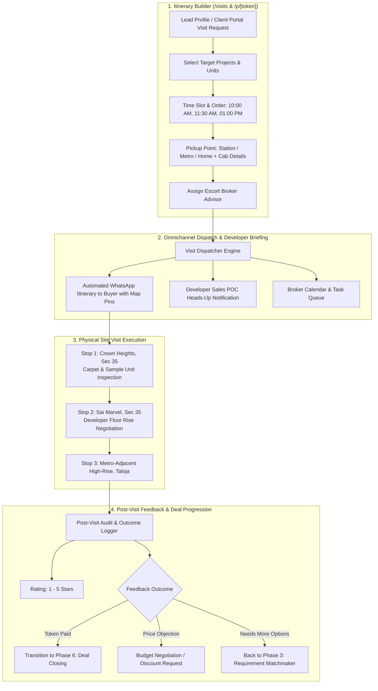

# Phase 5 Plan: Broker-Escorted Multi-Project Site Visit Itinerary Planner & Logistics Dispatcher

**Phase**: 05  
**Name**: Broker-Escorted Multi-Project Site Visit Itinerary Planner & Logistics Dispatcher  
**Agents**: `/agency-software-architect`, `/agency-backend-architect`, `/agency-frontend-developer`  
**Status**: Ready for Execution  

---

## 1. Architectural Scope & Operational Reality

In Indian real estate advisory and brokerage operations (specifically in high-velocity micro-markets like Kharghar and Taloja), **physical site visits are the single highest-leverage conversion event**. Buyers rarely visit a single project; a serious buyer dedicates a Saturday or Sunday morning to inspecting 2 to 4 competing projects in sequence.

Phase 5 implements the **Multi-Project Site Visit Coordinator & Dispatcher**. It coordinates client pickup logistics, sequences stops logically across micro-markets, alerts developer sales managers in advance, dispatches automated WhatsApp itineraries with interactive Google Maps pins, and captures structured post-visit feedback and objections.



---

## 2. Domain Decomposition & Aggregates

### 2.1 Bounded Contexts
1. **Itinerary & Routing Context**: Sequenced stops, estimated transit time between Navi Mumbai micro-markets, geographic optimization.
2. **Transit & Logistics Context**: Pickup location management (e.g. Kharghar Railway Station East, Central Park Metro, home address), dedicated cab/driver assignments.
3. **Developer Coordination Context**: Advance notification to builder sales heads/POCs with client requirement summaries.
4. **Post-Visit Outcome & Objection Context**: Standardized feedback categorization (`TOKEN_SUBMITTED`, `HIGH_INTEREST`, `PRICE_OBJECTION`, `LAYOUT_OBJECTION`, `NEEDS_MORE_OPTIONS`), star ratings, client objection notes.

### 2.2 Domain Invariants & Business Rules
* **Invariant 1 (No Schedule Collisions)**: A single broker cannot be assigned to overlapping site visit time slots on the same date.
* **Invariant 2 (Itinerary Completeness)**: Every itinerary stop must contain a valid unit reference, project location, expected time, and Google Maps navigation destination.
* **Invariant 3 (Lifecycle Progression)**:
  $$\text{SCHEDULED} \longrightarrow \text{CONFIRMED} \longrightarrow \text{IN\_PROGRESS} \longrightarrow \text{COMPLETED} \ (\text{or } \text{CANCELLED} / \text{NO\_SHOW})$$
* **Invariant 4 (Fast-Track Closing Trigger)**: When a site visit outcome is tagged `TOKEN_SUBMITTED`, the system automatically provisions a pending `DealTransaction` record in the Deal Closing Ledger (Phase 6).

---

## 3. Database Schema Extensions (PostgreSQL + Prisma)

### 3.1 DDL Schema Additions
```sql
-- 1. SITE VISITS & MULTI-PROJECT ITINERARIES
CREATE TABLE site_visits (
    id UUID PRIMARY KEY DEFAULT gen_random_uuid(),
    organization_id UUID NOT NULL REFERENCES organizations(id) ON DELETE CASCADE,
    lead_id UUID NOT NULL REFERENCES leads(id) ON DELETE CASCADE,
    assigned_broker_id UUID REFERENCES users(id),
    scheduled_date DATE NOT NULL,
    time_slot VARCHAR(50) NOT NULL, -- e.g. 'Saturday 11:00 AM'
    pickup_location VARCHAR(200) NOT NULL, -- e.g. 'Kharghar Railway Station (East)'
    cab_details VARCHAR(255),              -- e.g. 'Ertiga MH-46-AZ-1234 (Driver: Ramesh 9820011223)'
    status VARCHAR(30) NOT NULL DEFAULT 'SCHEDULED', -- 'SCHEDULED', 'CONFIRMED', 'IN_PROGRESS', 'COMPLETED', 'CANCELLED', 'NO_SHOW'
    
    -- Structured Itinerary Stops (JSON Array)
    -- [{ "unitId": "...", "projectName": "...", "microMarket": "...", "expectedTime": "11:00 AM", "developerPoc": "...", "googleMapsQuery": "..." }]
    itinerary_units_json JSONB NOT NULL DEFAULT '[]'::jsonb,
    
    -- Post-Visit Feedback & Deal Conversion
    feedback_notes TEXT,
    feedback_rating INT CHECK (feedback_rating BETWEEN 1 AND 5),
    feedback_outcome VARCHAR(50), -- 'TOKEN_SUBMITTED', 'HIGH_INTEREST', 'PRICE_OBJECTION', 'LAYOUT_OBJECTION', 'NEEDS_MORE_OPTIONS'
    
    created_at TIMESTAMPTZ NOT NULL DEFAULT NOW(),
    updated_at TIMESTAMPTZ NOT NULL DEFAULT NOW()
);
CREATE INDEX idx_visits_date_status ON site_visits(scheduled_date, status);
CREATE INDEX idx_visits_lead ON site_visits(lead_id);
CREATE INDEX idx_visits_broker ON site_visits(assigned_broker_id);
```

---

## 4. Backend Service Layer & Architectural Contracts

### 4.1 Site Visit Dispatcher Service (`src/lib/domain/visit-dispatcher.ts`)
```typescript
export interface ItineraryStopInput {
  unitId: string;
  projectName: string;
  microMarket: string;
  unitNumber?: string | null;
  bhk: number;
  expectedTime: string; // e.g. "11:00 AM"
  developerPocName?: string | null;
  developerPocPhone?: string | null;
  googleMapsQuery: string;
}

export interface SiteVisitScheduleInput {
  leadName: string;
  leadPhone: string;
  scheduledDateFormatted: string;
  timeSlot: string;
  pickupLocation: string;
  cabDetails?: string;
  assignedBrokerName: string;
  assignedBrokerPhone: string;
  stops: ItineraryStopInput[];
}

export function buildWhatsAppSiteVisitItinerary(params: SiteVisitScheduleInput): string;
```

### 4.2 REST API Endpoints (`src/app/api/v1/visits/`)
1. `GET & POST /api/v1/visits`: List scheduled visits with date range and status filters; schedule new multi-project visit.
2. `GET /api/v1/visits/:id`: Retrieve full visit details, itinerary stops, and lead requirement context.
3. `PATCH /api/v1/visits/:id`: Update visit timing, cab logistics, or assigned escort broker.
4. `POST /api/v1/visits/:id/dispatch-whatsapp`: Generate formatted WhatsApp deep links for buyer and developer sales POCs.
5. `POST /api/v1/visits/:id/feedback`: Record post-visit star rating, outcome tag, and trigger downstream CRM stage changes.

---

## 5. UI/UX Deliverables

### 5.1 Site Visit Command Center (`/visits`)
* **Interactive Schedule Matrix**:
  - Filter by Date (Today, This Weekend, Upcoming, Past), Status (Scheduled, In Progress, Completed), and Escort Broker.
  - Multi-Stop Visual Itinerary Cards displaying chronological sequence with time badges.
* **1-Click Itinerary Generator Modal**:
  - Select lead with auto-populated requirement profile.
  - Multi-select property units with drag-and-drop stop reordering.
  - Quick-preset pickup points (Kharghar Station, Central Park Metro, Taloja Station, Home Pickup).
  - Instant WhatsApp itinerary preview with one-tap clipboard copy.
* **Post-Visit Feedback Modal**:
  - Interactive 5-star rating selector.
  - Outcome pill buttons: 🟢 Token Submitted, 🔵 High Interest, 🟠 Price Objection, 🔴 Layout Objection.
  - Notes field with automatic quick-tags (*"Loved living room view"*, *"Wants higher floor"*, *"Discussing with spouse"*).

---

## 6. Verification & Acceptance Criteria (UAT)

1. **WhatsApp Itinerary Formatting Test**:
   - `buildWhatsAppSiteVisitItinerary` must generate a valid, readable WhatsApp text string containing all numbered stops, Google Maps URL links, pickup point, and broker phone number.
2. **Multi-Stop Itinerary Ingestion Test**:
   - Creating a visit with 3 stops must persist the JSON structure and correctly calculate the stops count in the UI.
3. **Post-Visit Outcome Workflow Test**:
   - Submitting feedback with `feedbackOutcome = "TOKEN_SUBMITTED"` must update the visit status to `COMPLETED` and update the lead's stage to `visit_done`.
4. **Date Filtering Test**:
   - Filtering `/api/v1/visits?date=2026-08-22` must return only visits scheduled for that specific date.
