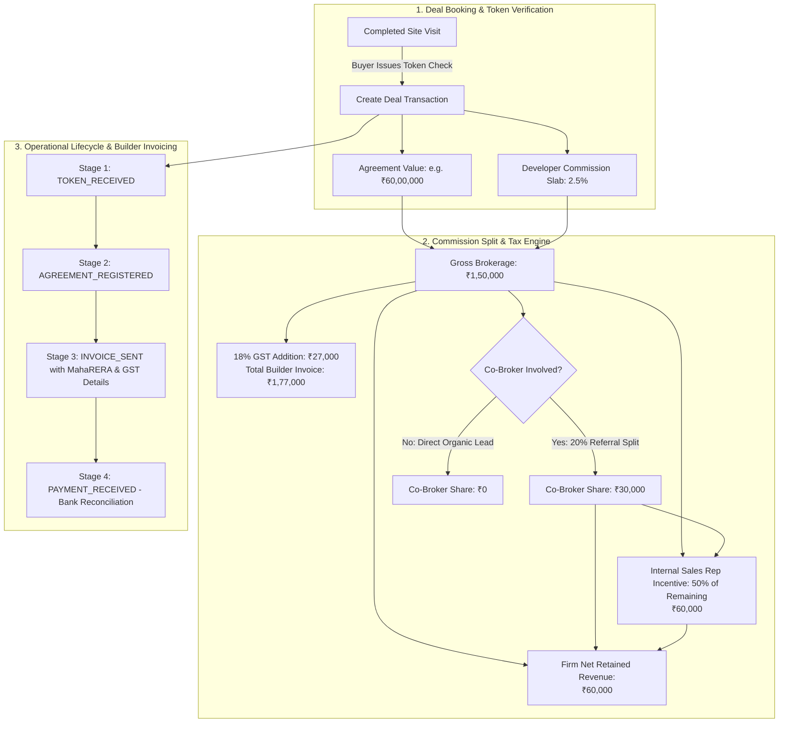

# Phase 6 Plan: Deal Closing, Brokerage Commission Split Ledger & Builder Invoicing

**Phase**: 06  
**Name**: Deal Closing, Brokerage Commission Split Ledger & Builder Invoicing  
**Agents**: `/agency-finance-tracker`, `/agency-software-architect`, `/agency-backend-architect`  
**Status**: Ready for Execution  

---

## 1. Architectural Scope & Financial Mechanics

Real estate brokerage revenue recognition differs fundamentally from direct developer sales. The brokerage does not collect the full property purchase price; instead, it earns a **statutory developer commission (typically 2.0% to 3.5%)** on the Agreement Value ($V_{\text{agreement}}$), subject to 18% GST invoicing, internal sales rep incentive payouts, and external channel partner/co-broker commission splits.

Phase 6 implements the **Deal Closing & Commission Ledger Engine**. It tracks deals across their operational lifecycle (Token Paid $\rightarrow$ Agreement Registered $\rightarrow$ Invoice Dispatched $\rightarrow$ Payment Received), computes multi-party revenue allocations deterministically, generates RERA-compliant tax invoices for developers, and maintains an immutable audit trail of brokerage receivables.



---

## 2. Mathematical Models & Financial Invariants

### 2.1 Commission & Split Formulas
1. **Gross Brokerage**:
   $$\text{Gross Brokerage} = \left\lfloor V_{\text{agreement}} \times \frac{\text{Brokerage \%}}{100} \right\rfloor$$
2. **Statutory 18% GST on Invoicing**:
   $$\text{GST Amount} = \left\lfloor \text{Gross Brokerage} \times 0.18 \right\rfloor$$
   $$\text{Total Invoice Amount} = \text{Gross Brokerage} + \text{GST Amount}$$
3. **External Co-Broker / Sub-Broker Referral Allocation**:
   $$\text{Co-Broker Share} = \left\lfloor \text{Gross Brokerage} \times \frac{\text{Co-Broker \%}}{100} \right\rfloor$$
4. **Internal Sales Executive Incentive**:
   $$\text{Rep Commission} = \left\lfloor (\text{Gross Brokerage} - \text{Co-Broker Share}) \times \frac{\text{Rep Split \%}}{100} \right\rfloor$$
5. **Firm Net Retained Margin**:
   $$\text{Firm Net Revenue} = \text{Gross Brokerage} - \text{Rep Commission} - \text{Co-Broker Share}$$

### 2.2 Financial Invariants
* **Invariant 1 (Balance Conservation)**: The sum of `firmNetBrokerageAmount`, `repCommissionAmount`, and `coBrokerAmount` must ALWAYS exactly equal `grossBrokerageAmount`.
* **Invariant 2 (MahaRERA Invoice Compliance)**: Developer invoices cannot be generated without the brokerage's registered RERA broker ID and GSTIN.
* **Invariant 3 (Lifecycle Monotonicity)**: A deal cannot be marked `PAYMENT_RECEIVED` without a populated invoice number and payment date.

---

## 3. Database Schema Extensions (PostgreSQL + Prisma)

### 3.1 DDL Schema Additions
```sql
-- 1. DEAL TRANSACTIONS & COMMISSION LEDGER
CREATE TABLE deal_transactions (
    id UUID PRIMARY KEY DEFAULT gen_random_uuid(),
    organization_id UUID NOT NULL REFERENCES organizations(id) ON DELETE CASCADE,
    lead_id UUID NOT NULL REFERENCES leads(id) ON DELETE CASCADE,
    property_unit_id UUID NOT NULL REFERENCES property_units(id) ON DELETE CASCADE,
    developer_project_id UUID NOT NULL REFERENCES developer_projects(id) ON DELETE CASCADE,
    closing_broker_id UUID REFERENCES users(id),
    
    -- Financial Slabs (INR)
    agreement_value NUMERIC(12, 2) NOT NULL,
    brokerage_percent NUMERIC(4, 2) NOT NULL DEFAULT 2.50,
    gross_brokerage_amount NUMERIC(12, 2) NOT NULL,
    rep_commission_amount NUMERIC(12, 2) NOT NULL DEFAULT 0.00,
    firm_net_brokerage_amount NUMERIC(12, 2) NOT NULL,
    co_broker_name VARCHAR(150),
    co_broker_share_percent NUMERIC(4, 2) DEFAULT 0.00,
    
    -- Transaction Lifecycle & Invoicing
    booking_date DATE NOT NULL DEFAULT CURRENT_DATE,
    deal_status VARCHAR(40) NOT NULL DEFAULT 'TOKEN_RECEIVED', -- 'TOKEN_RECEIVED', 'AGREEMENT_REGISTERED', 'INVOICE_SENT', 'PAYMENT_RECEIVED', 'CANCELLED'
    developer_invoice_number VARCHAR(100),
    payment_received_date DATE,
    notes TEXT,
    
    created_at TIMESTAMPTZ NOT NULL DEFAULT NOW(),
    updated_at TIMESTAMPTZ NOT NULL DEFAULT NOW()
);
CREATE INDEX idx_deals_status ON deal_transactions(deal_status);
CREATE INDEX idx_deals_lead ON deal_transactions(lead_id);
CREATE INDEX idx_deals_project ON deal_transactions(developer_project_id);
CREATE INDEX idx_deals_broker ON deal_transactions(closing_broker_id);
```

---

## 4. Backend Service Layer & Architectural Contracts

### 4.1 Commission Calculator Service (`src/lib/domain/commission-calculator.ts`)
```typescript
export interface CommissionCalculationInput {
  agreementValue: number;
  brokeragePercent?: number;      // default 2.5%
  repSplitPercent?: number;        // default 50%
  coBrokerSharePercent?: number;   // default 0%
}

export interface CommissionCalculationResult {
  agreementValue: number;
  brokeragePercent: number;
  grossBrokerageAmount: number;
  gstAmount: number;
  totalInvoiceAmountWithGst: number;
  repCommissionAmount: number;
  coBrokerAmount: number;
  firmNetBrokerageAmount: number;
}

export function calculateDealCommission(input: CommissionCalculationInput): CommissionCalculationResult;
```

### 4.2 REST API Endpoints (`src/app/api/v1/deals/`)
1. `GET & POST /api/v1/deals`: List closed deals with status, developer, and rep filters; record new deal closing.
2. `GET /api/v1/deals/:id`: Retrieve deal financial ledger, payment milestones, and unit details.
3. `PATCH /api/v1/deals/:id`: Update deal stage (`TOKEN_RECEIVED` $\rightarrow$ `PAYMENT_RECEIVED`), invoice number, or payment date.
4. `POST /api/v1/deals/simulate-commission`: Stateless calculator endpoint for brokers to project commission earnings before closing.

---

## 5. UI/UX Deliverables

### 5.1 Deal Closing Command Center (`/deals`)
* **Executive Revenue Metrics Bar**:
  - 💰 **Total Closed Deals**: Volume of registered transactions.
  - 📈 **Gross Brokerage Billed**: Cumulative brokerage pipeline.
  - 🏦 **Realized Collections**: Bank-cleared brokerage funds.
  - ⏳ **Unbilled / Pending Invoices**: Receivables awaiting developer disbursement.
* **Deal Ledger Table**:
  - Live table with filters by Deal Status, Developer Project, Closing Broker, and Date Range.
  - Status Pills: 🟡 Token Received, 🔵 Agreement Registered, 🟣 Invoice Sent, 🟢 Payment Received, 🔴 Cancelled.
  - Financial Breakdown Badges: Agreement Value, Gross Brokerage, Rep Payout, Firm Net.
* **New Deal Booking Modal**:
  - Select lead and property unit with auto-populated agreement value.
  - Interactive slider for Brokerage % (1.0% to 5.0%) and Rep Incentive Split % (30% to 70%).
  - Optional Co-Broker / Channel Partner toggle with referral percentage input.
  - Live calculation preview showing exact rupee allocations.
* **Developer Tax Invoice Generator**:
  - Printable / PDF-ready GST invoice formatted with ZamZam Properties RERA Broker ID, Developer GSTIN, and Bank NEFT/RTGS details.

---

## 6. Verification & Acceptance Criteria (UAT)

1. **Commission Calculation Accuracy Test**:
   - For an Agreement Value of ₹60,00,000 at 2.5% brokerage, 50% rep split, and 0% co-broker:
     - Gross Brokerage must equal **₹1,50,000**.
     - 18% GST must equal **₹27,000** (Total Invoice: **₹1,77,000**).
     - Rep Commission must equal **₹75,000**.
     - Firm Net Brokerage must equal **₹75,000**.
2. **Co-Broker Split Test**:
   - For the same ₹60,00,000 deal with 20% co-broker split:
     - Co-Broker Share must equal **₹30,000**.
     - Rep Commission (50% of ₹1,20,000) must equal **₹60,000**.
     - Firm Net Brokerage must equal **₹60,000**.
3. **Conservation Invariant Test**:
   - $\text{Firm Net} + \text{Rep Commission} + \text{Co-Broker Share} \equiv \text{Gross Brokerage}$ must hold true across all arbitrary input parameters.
4. **Deal Progression Test**:
   - Updating deal status to `PAYMENT_RECEIVED` must update the lead's stage to `closed_won` and record timestamp.
