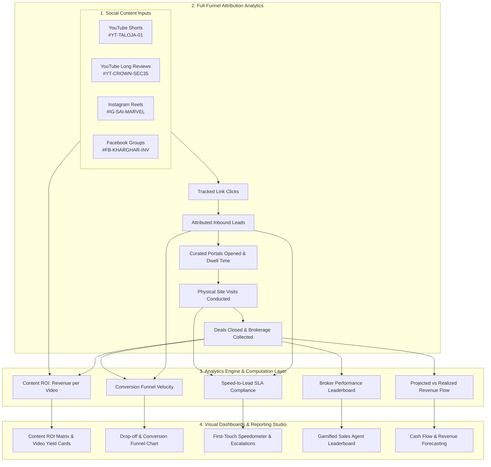

# Phase 7 Plan: Organic Social Content ROI, Conversion Analytics & Broker Leaderboards

**Phase**: 07  
**Name**: Organic Social Content ROI, Conversion Analytics & Broker Leaderboards  
**Agents**: `/agency-analytics-reporter`, `/agency-growth-hacker`, `/agency-software-architect`  
**Status**: Ready for Execution  

---

## 1. Architectural Scope & Strategic Purpose

Because ZamZam Properties operates with a zero-ad-spend organic growth model, **content is capital**. Every YouTube walkthrough video, YouTube Short, Instagram Reel, and Facebook community broadcast is an investment of time and production resources. 

Phase 7 delivers the **Executive Business Intelligence & Content ROI Engine**. It connects the dots across the entire pipeline: from the exact YouTube video or Instagram reel that generated a lead (Phase 2), through requirement matching (Phase 3), client portal engagement (Phase 4), site visit completion (Phase 5), to closed gross brokerage revenue (Phase 6).



---

## 2. Mathematical Models & Analytics Metrics

### 2.1 Content Performance & Financial Yield
1. **Video/Reel Conversion Rate ($CR_{\text{content}}$)**:
   $$CR_{\text{lead}} = \frac{\text{Total Leads Generated}}{\text{Total Link Clicks}} \times 100$$
   $$CR_{\text{deal}} = \frac{\text{Closed Deals}}{\text{Total Leads Generated}} \times 100$$
2. **Gross Revenue Yield per Content Piece ($Y_{\text{content}}$)**:
   $$Y_{\text{content}} = \sum_{i=1}^{N} \text{Gross Brokerage of Deal}_i \quad \forall \text{ Deals with } \text{Campaign} = C$$
3. **Revenue Per Click (RPC)**:
   $$\text{RPC} = \frac{Y_{\text{content}}}{\text{Total Clicks}}$$

### 2.2 Sales Execution & Speed-to-Lead SLA
* **Speed-to-Lead First Touch ($T_{\text{first\_touch}}$)**:
  $$T_{\text{first\_touch}} = \text{Timestamp}_{\text{First Outbound Comm}} - \text{Timestamp}_{\text{Lead Ingestion}}$$
  - 🟢 **Optimal**: $< 5\text{ minutes}$
  - 🟡 **Acceptable**: $5\text{--}30\text{ minutes}$
  - 🔴 **SLA Breach**: $> 30\text{ minutes}$ (Triggers manager escalation)
* **Visit-to-Close Conversion Ratio**:
  $$\text{Visit Conversion} = \frac{\text{Deals with Token Submitted}}{\text{Completed Site Visits}} \times 100$$

### 2.3 Micro-Market Velocity & Locality Yield
* **Micro-Market Demand Share**:
  $$\text{Locality Share} = \frac{\text{Leads interested in Locality } L}{\text{Total Leads}} \times 100$$
  - Kharghar Sector 35 vs Sector 20 vs Taloja Phase 1 & 2.

---

## 3. Database Schema & Aggregation Views

### 3.1 Analytics Views & Aggregated Queries
```sql
-- 1. CAMPAIGN REVENUE ATTRIBUTION VIEW
CREATE VIEW view_campaign_content_roi AS
SELECT 
    c.id AS campaign_id,
    c.campaign_name,
    c.channel_type,
    c.content_id,
    c.custom_slug,
    c.total_clicks,
    COUNT(DISTINCT l.id) AS total_leads,
    COUNT(DISTINCT v.id) AS total_site_visits,
    COUNT(DISTINCT d.id) AS total_deals_closed,
    COALESCE(SUM(d.gross_brokerage_amount), 0) AS total_gross_brokerage,
    COALESCE(SUM(d.firm_net_brokerage_amount), 0) AS total_firm_net_revenue
FROM inbound_campaigns c
LEFT JOIN leads l ON l.campaign_id = c.id
LEFT JOIN site_visits v ON v.lead_id = l.id AND v.status = 'COMPLETED'
LEFT JOIN deal_transactions d ON d.lead_id = l.id AND d.deal_status = 'PAYMENT_RECEIVED'
GROUP BY c.id, c.campaign_name, c.channel_type, c.content_id, c.custom_slug, c.total_clicks;

-- 2. SALES AGENT PERFORMANCE VIEW
CREATE VIEW view_agent_performance_leaderboard AS
SELECT 
    u.id AS user_id,
    u.full_name,
    u.role,
    COUNT(DISTINCT l.id) AS assigned_leads_count,
    COUNT(DISTINCT cp.id) AS portals_created_count,
    COUNT(DISTINCT v.id) AS visits_conducted_count,
    COUNT(DISTINCT d.id) AS deals_closed_count,
    COALESCE(SUM(d.gross_brokerage_amount), 0) AS total_brokerage_generated,
    COALESCE(SUM(d.rep_commission_amount), 0) AS total_incentive_earned
FROM users u
LEFT JOIN leads l ON l.assigned_broker_id = u.id
LEFT JOIN client_portals cp ON cp.created_by_user_id = u.id
LEFT JOIN site_visits v ON v.assigned_broker_id = u.id AND v.status = 'COMPLETED'
LEFT JOIN deal_transactions d ON d.closing_broker_id = u.id AND d.deal_status = 'PAYMENT_RECEIVED'
WHERE u.is_active = TRUE
GROUP BY u.id, u.full_name, u.role;
```

---

## 4. Backend Service Layer & Architectural Contracts

### 4.1 Analytics Aggregation Service (`src/lib/domain/analytics-engine.ts`)
```typescript
export interface ContentRoiReport {
  campaignId: string;
  campaignName: string;
  channelType: string;
  contentId: string | null;
  totalClicks: number;
  totalLeads: number;
  totalVisits: number;
  totalDeals: number;
  grossBrokerageRupees: number;
  firmNetRupees: number;
  conversionRatePercent: number;
  revenuePerClick: number;
}

export interface AgentLeaderboardEntry {
  userId: string;
  fullName: string;
  role: string;
  assignedLeads: number;
  portalsCreated: number;
  visitsConducted: number;
  dealsClosed: number;
  grossBrokerageGenerated: number;
  repIncentiveEarned: number;
  visitConversionRate: number;
}

export interface FunnelStageMetric {
  stageName: string;
  count: number;
  dropOffRatePercent: number;
  averageDwellHours: number;
}

export function computeContentRoi(campaigns: any[], deals: any[], leads: any[]): ContentRoiReport[];
export function computeAgentLeaderboard(users: any[], deals: any[], visits: any[], portals: any[]): AgentLeaderboardEntry[];
```

### 4.2 REST API Endpoints (`src/app/api/v1/analytics/`)
1. `GET /api/v1/analytics/content-roi`: Content-level revenue and inquiry conversion report with channel breakdowns.
2. `GET /api/v1/analytics/agent-leaderboard`: Gamified sales broker leaderboard with conversion benchmarks.
3. `GET /api/v1/analytics/funnel`: Full conversion funnel telemetry (`Inquiry` $\rightarrow$ `Portal` $\rightarrow$ `Visit` $\rightarrow$ `Token` $\rightarrow$ `Won`).
4. `GET /api/v1/analytics/cash-flow`: Receivables and collections forecast grouped by payment milestone.

---

## 5. UI/UX Deliverables

### 5.1 Executive & Content ROI Dashboard (`/` & `/attribution`)
* **Content Performance Matrix**:
  - Top Performing Social Content ranking table.
  - Video cards with direct thumbnail/link preview, total leads generated, visits scheduled, and closed rupee brokerage.
  - Channel Breakdown Chart: YouTube Shorts vs YouTube Long Reviews vs Instagram Reels vs FB Groups.
* **Conversion Funnel Visualization**:
  - Interactive visual funnel with step-by-step drop-off analysis:
    $$\text{Clicks (100\%)} \longrightarrow \text{Leads (18.2\%)} \longrightarrow \text{Portals Opened (74\%)} \longrightarrow \text{Site Visits (38\%)} \longrightarrow \text{Deals (42\%)}$$
* **Sales Agent Leaderboard**:
  - Rank cards with trophies (🥇 Gold, 🥈 Silver, 🥉 Bronze).
  - Metrics: Deals Closed, Gross Brokerage, Escorted Visits, Average Speed-to-Call.
* **Micro-Market Demand Heatmap**:
  - Locality demand share pills (Kharghar Sector 35: 42%, Taloja Phase 1: 33%, Kharghar Sector 20: 25%).

---

## 6. Verification & Acceptance Criteria (UAT)

1. **Content ROI Attribution Test**:
   - When a deal is closed for a lead created via campaign `yt-taloja-01` with ₹1,50,000 brokerage, `computeContentRoi` must attribute ₹1,50,000 gross revenue and 1 closed deal specifically to `yt-taloja-01`.
2. **Revenue Per Click Calculation Test**:
   - For a campaign with 200 clicks and ₹1,00,000 gross brokerage, RPC must evaluate to **₹500.00 / click**.
3. **Agent Leaderboard Aggregation Test**:
   - Closing deals under `userId = "broker-01"` must increment the broker's `dealsClosed` count and update their rank on the leaderboard.
4. **Funnel Monotonicity Test**:
   - The funnel query must return accurate counts and calculate valid drop-off percentages without dividing by zero when leads are zero.
