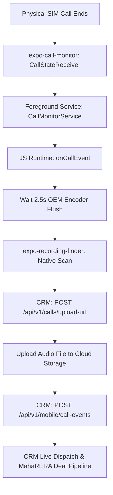

# Lucky Mobile Companion (React Native Expo)

High-performance, hardware-integrated mobile companion app for **Lucky CRM**. Replaces the legacy pure Android Kotlin app with a modern **React Native + Expo SDK 57** architecture while retaining full native hardware telemetry and OEM call recording synchronization.

---

## 🏛️ Architecture Overview



### Key Technical Pillars:
1. **Expo Router (`app/`)**: File-based routing with dark aesthetic (`#070913`), authentication guards, and tabbed dashboard.
2. **`expo-call-monitor`**: Native Android module wrapping `TelephonyManager`, `CallLog`, `BroadcastReceiver`, and a `phoneCall` foreground service with persistent notifications.
3. **`expo-recording-finder`**: High-speed filesystem and `MediaStore` scanner supporting:
   - Samsung OneUI (`/storage/emulated/0/Recordings/Call`)
   - Xiaomi MIUI & HyperOS (`/storage/emulated/0/MIUI/sound_recorder/call_rec`)
   - Realme / OPPO ColorOS (`/storage/emulated/0/PhoneRecord`)
   - Vivo FuntouchOS (`/storage/emulated/0/Record/Call`)
   - MediaStore Audio Fallback
4. **Resilient Sync Engine (`lib/sync-service.ts`)**: 2.5s hardware buffer, exponential retry, upload ticket negotiation, and Zustand reactive store.

---

## 📱 App Screens

- **`app/(auth)/login.tsx`**: OTP Phone login with configurable host URL, 6-digit passcode auto-focus, and MahaRERA broker authentication.
- **`app/(tabs)/index.tsx`**: Dashboard with master foreground service toggle, real-time sync metrics, OEM directory diagnostics, and test simulation button.
- **`app/(tabs)/calls.tsx`**: Call history with direction filters (Incoming, Outgoing, Missed), sync badges, and audio recording playback links.
- **`app/(tabs)/settings.tsx`**: CRM host endpoint test ping, Android telephony permissions audit, custom OEM path override, and sign-out.

---

## 🚀 Getting Started

### 1. Install Dependencies
```bash
cd mobile-companion
bun install
```

### 2. Type Checking
```bash
bun run tsc --noEmit
```

### 3. Start Development Server
```bash
bun run start
```

### 4. Build Standalone Android APK (EAS Cloud)
To generate a downloadable `.apk` for physical device sideloading:
```bash
eas build --platform android --profile preview
```

### 5. Local Native Prebuild
To inspect or compile the native Android Gradle project locally:
```bash
bun run prebuild
cd android && ./gradlew assembleRelease
```
